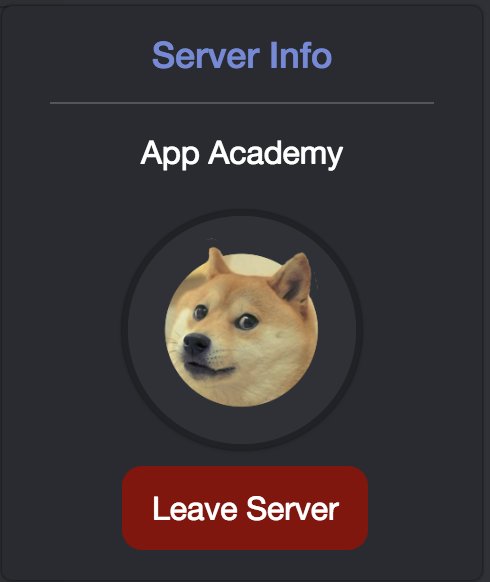

# Disunity-Unity-
Discord clone

# Disunity

Disunity is a website designed to make playing games with your friends simple and straightforward, inspired from Discord. It utlizes a Rails/PostgreSQL backend with React.js and Redux for the frontend.

This project was designed and developed over 10 days, and I plan to continue improving and adding features over time.

### Live Demo: [Disunity](https://disunity.herokuapp.com/#/)

## Features 
---
- Takes advantage of SecureRandom and BCrypt to authenticate, and secure the frontend and backend.
- Users can create servers, and upload images to be used as server icons.
- Users can join servers through name.
- Server Admins can edit/delete the server, and add channels.
- Components have respective modals or dropdowns that are utilized to edit or delete the object.  

### Administrator Privileges and Conditional Rendering

The dashboard will render each component different based on whether or not you are the administrator for the server. This occurs when you want to add, edit, or delete channels.  Or when you want to edit or delete the server.  If you are not the administrator the user will be able to leave the server, rather than edit or delete it.   

## Pending Features
---
**Real time active chat via Rails Action Cable.**

Text channels will update in real time for all users current online.  By utilizing Action Cable, each users message slice of state will update automatically when a new message is posted to the database.

**Search bar that returns matching users, servers, and messages**

Users will be able to utilize the search bar to find users, match messages, and servers.  This would be useful for finding servers of interest, or messages with information that they want to reference. 

**Chats will parse images and links**

Messages will recognize if they contain an image, video, or link and correctly display these in the chat.

**Implementing system to display online users**

Disunity will display users who are currently online in each respective server so that other users will know if they are active or not.

**Friendships between users and Direct Messages**

Users will be able to add each other as friends, seeing their online status and be able to communicate with each other without being in the same server through direct messages.